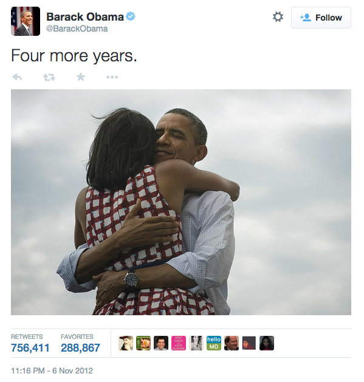
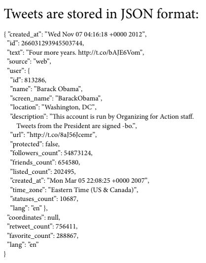
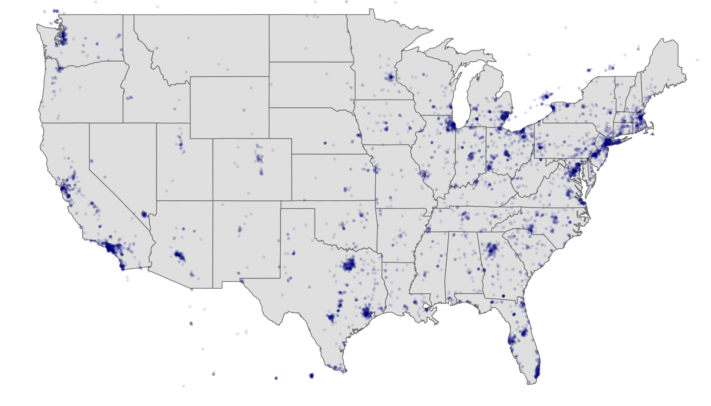
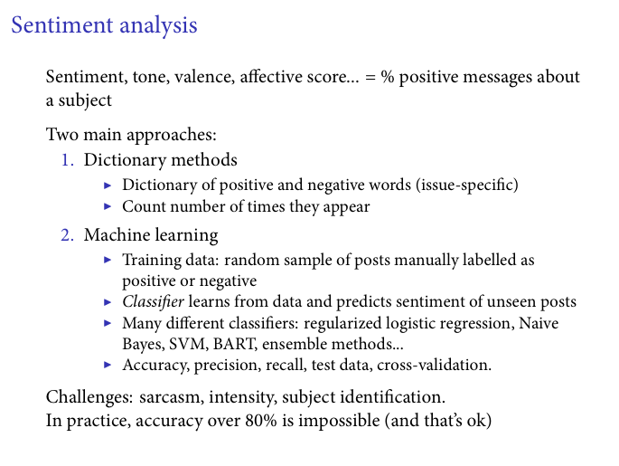
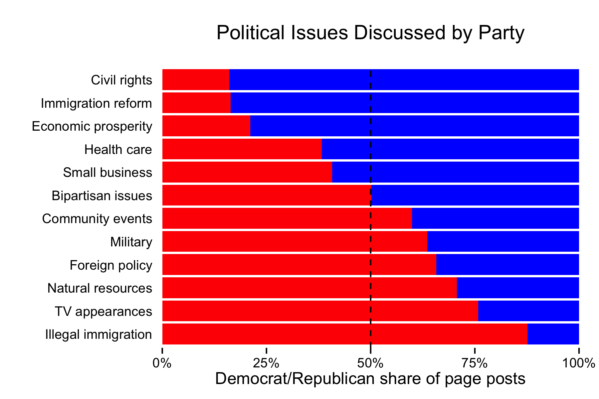

WORKSHOP: Collecting and Analyzing Social Media Data with R
--------------

This github repository contains the materials and slides that I prepared for the 2-hour workshop on social media data analysis I gave as part of the Introduction to Data Science course at Georgetown University on February 2nd, 2015.

The purpose of the workshop was to provide an overview of the available tools to interact with the public APIs of the three most popular social media websites - Twitter, Facebook, and Instagram - and to illustrate potential applications relevant to the social sciences.

It was structured in three different parts. I started by motivating why social scientists should pay attention to social media as a new source of data about human behavior, and as a new communication tool with a large impact on different political and social phenomena. I offered examples of recent publications that illustrate each approach, including some of my own research.

The second part introduced the concept of Web API, the difference between REST API and Streaming API, what JSON data looks like, and the basics of how API requests are constructed. I also gave an overview of existing R packages that allow researchers to collect and interact with web data.

	

The rest of the workshop was devoted to explaining the data that is available through the Twitter, Facebook, and Instagram public APIs and how it can be collected using R, with different examples of analyses that can be conducted with this data. All the code that I showed in class is available in this repository.

The script `01-twitter-data-collection.r` demonstrates how the `twitteR` and `streamR` packages can be used to collect data from Twitter's REST and Streaming API. This data is then used in the script `02-twitter-data-analysis.r` to showcase two frequent analyses that rely on Twitter data: a map of geolocated tweets to examine the geographic distribution of human activity, and an estimation of the favorability of Barack Obama based on tweets that mention him using sentiment analysis.

The scripts `03-facebook-data-collection.r` and `04-facebook-data-analysis` follow a similar logic. First, I show how to collect data from public pages on Facebook using the `Rfacebook` package, including post information, likes, and comments. Then, I replicate an analysis conducted by <a href="https://solomonmessing.wordpress.com/">Solomon Messing</a> and other members of the <a href="https://www.facebook.com/data">Facebook Data Science</a> team that looks at <a href="https://www.facebook.com/notes/facebook-data-science/campaign-rhetoric-and-style-on-facebook-in-the-2014-us-midterms/10152581594083859">campaign rethoric of Members of the U.S. Congress</a> on their Facebook pages. In particular, I show how to collect and clean the text posted on the legislators' pages, and then run a topic modeling technique (LDA) to estimate the proportion of time they spend discussing each political issue.

Finally, the script `05-instagram-data` shows how to access Instagram data using R, including images filtered by hashtag, location, and user.

